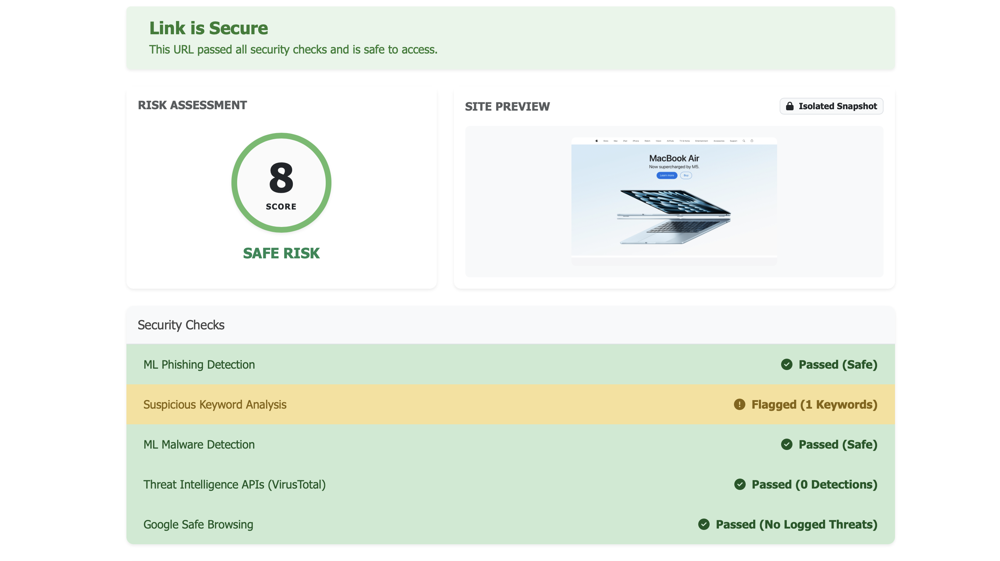

<<<<<<< HEAD
# secure-qr-threat-detection
Secure QR-Based Intelligent Threat Detection Framework using Python, Flask, OpenCV and Machine Learning.

## Overview

This project detects malicious QR codes using Machine Learning and Flask.

## screenshots 

### Login Page

### Dashboard

### QR Scanner

### Detection Result

=======
# Secure QR-Based Intelligent Threat Detection Framework

## Overview

This project detects malicious QR codes using Machine Learning, OpenCV, Flask and VirusTotal API.
>>>>>>> 37239af8f0b13ee55ccf051fe062e4429692000f
