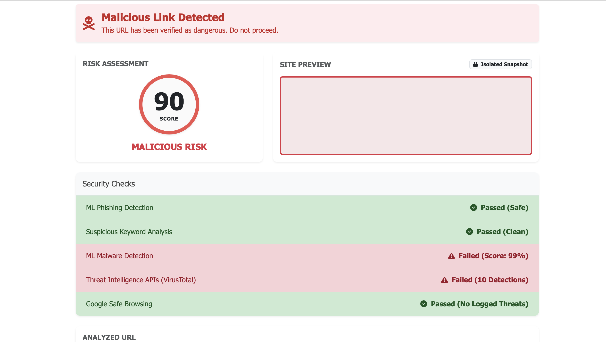

<<<<<<< HEAD
# secure-qr-threat-detection
Secure QR-Based Intelligent Threat Detection Framework using Python, Flask, OpenCV and Machine Learning.

## Overview

This project detects malicious QR codes using Machine Learning and Flask.

<<<<<<< HEAD
### Detection Result Safe

### Detection Result Malicious

=======
### Detection Result Safe

### Detection Result Malicious

>>>>>>> some-branch-name
